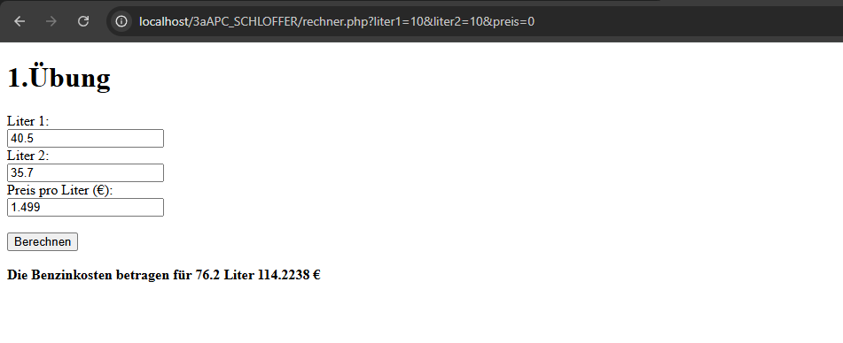
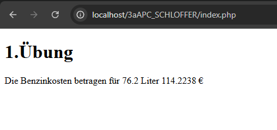

# Aufgabe 2: erste PHP Applikation

Author: Schloffer Lisa
3aAPC | 2025/26

Es befinden sich 2 PHP Datein in diesem Projekt, das mit dem Namen "statisch.php" ist der erste Versuch mit statischen Daten.

Die Datei mit dem Namen "rechner.php" ist der Rechner, bei dem der Benutzer die Daten eingeben kann.

Es war neu für mich, da ich davor noch nie wirklich etwas in PHP progammiert habe und nur die Basics selbst erlernt hatte, weshalb ich mich bei Fragen an meine Kollegin gewandt habe.

Das Ergebnis ist aber selbstständig umgesetzt und funktioniert.

Hier sieht man die Umsetzung:

